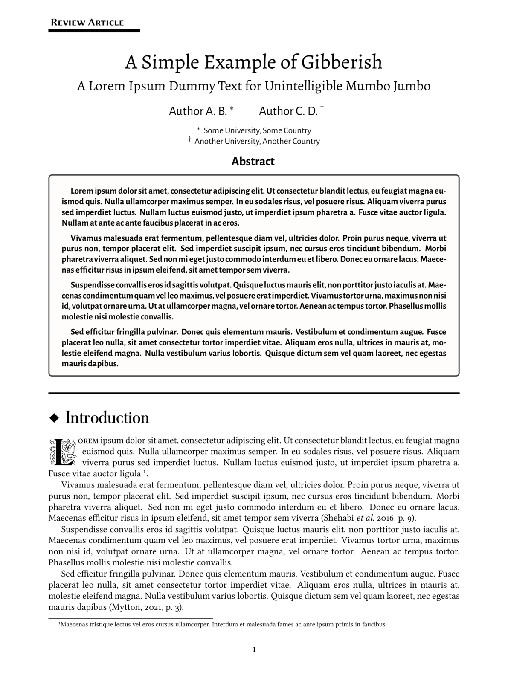

<p align="center">
    
</p>
<h1 align="center">Pandoc Template</h1>
<p align="center"><strong><em>The</em> Pandoc template <em>made for</em> academic papers with a personal style</strong></p>
<p align="center">
    
</p>

# Usage

```bash
$ ./pandoc.sh
```
